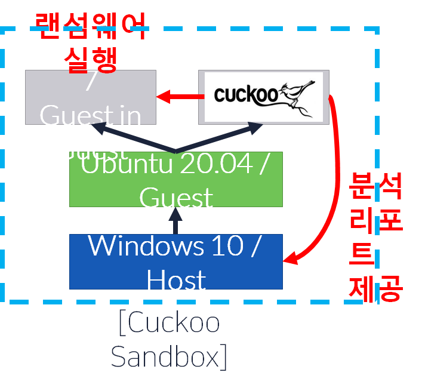
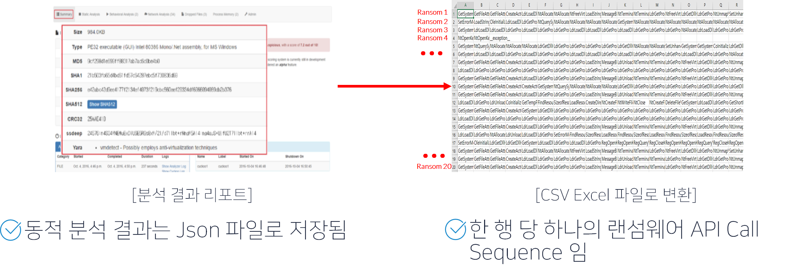
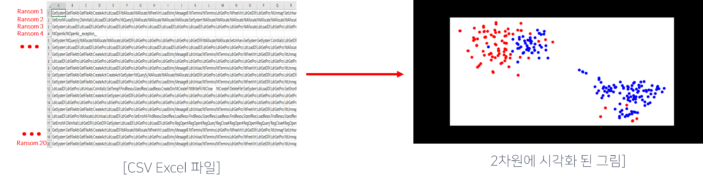
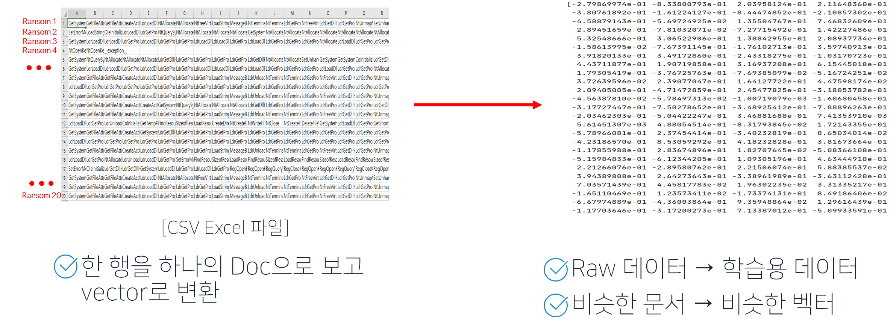

# AI를 이용한 Ransomware 분석 모델

#### 과제 목표

- 동적 분석 + 머신러닝 = 랜섬웨어 분류

#### 데이터 수집 경로

- 산학협력 멘토링
- Github에 공개된 랜섬웨어 샘플
- 정상 소프트웨어 250개, 랜섬웨어 142개 수집

#### 사용한 알고리즘

- Doc2Vec
  - 문장, 문단, 문서 단위로 벡터를 생성
- t-SNE
  - 높은 차원의 복잡한 데이터를 2차원에 차원 축소하는 방법
  - 데이터 시각화가 주 목적
  - 비슷한 데이터 구조는 낮은 차원 공간에서 가깝게 대응하고, 비슷하지 않은 데이터 구조는 멀리 떨어져 대응
  
- Ensemble 알고리즘(xgboost, randomforest, gbm)

- Bayesian optimization
  - 임의의 함수 f(프로젝트에선 모델)값을 가장 크게 혹은 작게 하는 해를 구하는 것
  - 하이퍼파라미터들을 조정하여 주어진 데이터 셋에 대해서 가장 좋은 결과를 내주는 파라미터 값을 찾아준다.

#### 프로젝트 수행 과정

- Cuckoo Sandbox
  - 악성코드를 동적 분석 하기 위한 자동화 샌드박스 툴
  - 제한된 환경에서 랜섬웨어를 직접 실행 후 API Call Sequence를 출력

- 학습용 API Call Sequence

  

  

- CSV 파일로 Doc2Vec 모델 생성

  - 데이터를 벡터로 바꿔주는 Doc2Vec 모델 생성

  - 생성된 Doc2Vec 모델 t-sne를 이용해 시각화(파란색: 정상, 빨간색 : 랜섬웨어)

    

- 생성된 Doc2Vec 모델로 학습 데이터 생성

  

- 모델 학습

  - 학습 데이터를 이용해 모델 학습
    - Xgboost 학습 알고리즘 사용 (비교를 위해 랜덤포레스트, GBM 사용)
    - K-Fold Cross Validation 사용(K = 5)
    - 성능 향상을 위해 하이퍼파라미터 튜닝 : Bayesian Optimization 이용

- 다른 모델들과 비교

  |               | **XgBoost** | **GBM**   | **Random Forest** |
  | ------------- | ----------- | --------- | ----------------- |
  | **Accuracy**  | **96.48**   | **95.77** | **93.66**         |
  | **Precision** | **93.02**   | **92.86** | **85.11**         |
  | **Recall**    | **95.24**   | **92.86** | **95.24**         |
  | **F1 Score**  | **94.12**   | **92.86** | **89.89**         |
  | **AUC**       | **96.11**   | **94.92** | **94.11**         |

- 결론
  - 부족한 학습 데이터 개수로 인해 모델의 신뢰성이 낮음 -> 데이터 수 늘리기
  - 일부 랜섬웨어는 분석 환경에서 동작하지 않았음 -> 동적 분석 환경 다양화

참조논문

- 랜섬웨어 탐지를 위한 동적 분석 자료에서의 변수 선택에 관한 연구
- API 순차적 특징을 이용한 악성코드 변종 분류 기법 [한경수]
- word2vec을 활용한 사례
